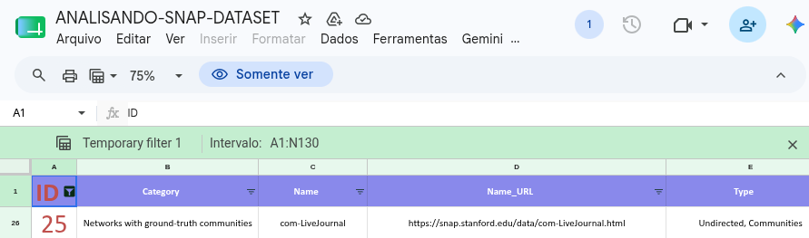
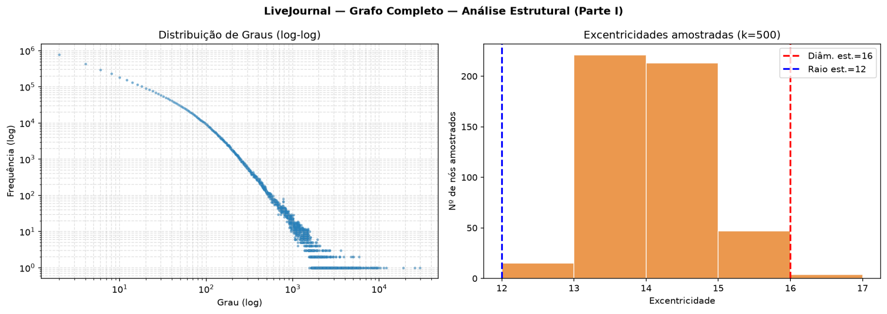
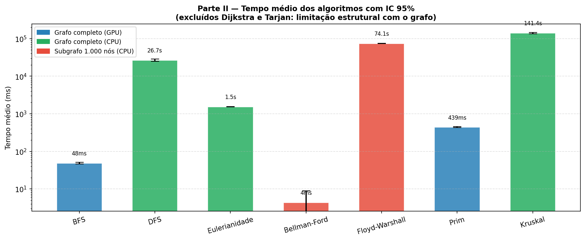
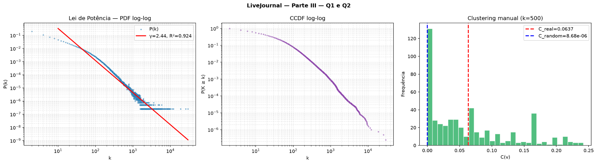
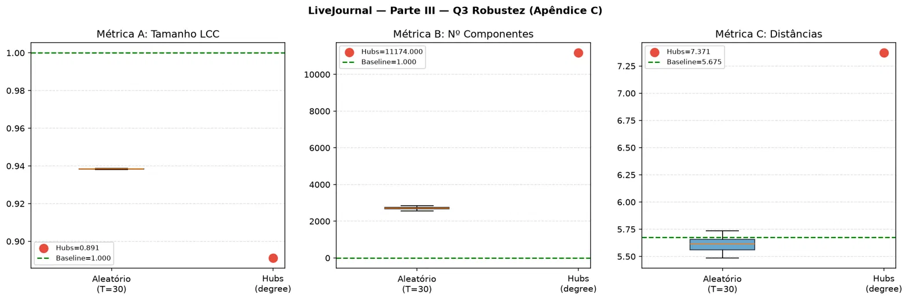

224115861.pdf
# Cálculo de Determinação do Grafo a ser Utilizado

De acordo com a regra de mapeamento determinada nas orientações do trabalho, dado o número de matrícula $M$, o ID do grafo a ser selecionado é dado por:
$$
f(M) = ((\text{soma dos dígitos de } M) \times (\text{últimos 2 dígitos de } M + 1)) \bmod 129
$$

Para a matrícula **224115861**:
- Soma dos dígitos = $2 + 2 + 4 + 1 + 1 + 5 + 8 + 6 + 1 = 30$
- Últimos dois dígitos = $61$

O cálculo resultante é:
$$
f(M) = (30 \times (61 + 1)) \bmod 129 = (30 \times 62) \bmod 129 = 1860 \bmod 129 = 25
$$

Conforme o ID obtido na planilha de referência, o conjunto de dados correspondente é o **"LiveJournal social network and ground-truth communities"**, pertencente à categoria de redes sociais e comunidades ground-truth, caracterizado por ser um grafo não direcionado com comunidades reais.

{#fig-selecao-dataset width=90%}

O código-fonte completo deste projeto, incluindo scripts de processamento e execução dos experimentos, está disponível no GitHub:
- **Repositório:** <https://github.com/Carolbalbs/tp-final>

# Descrição do Grafo Original

O conjunto de dados utilizado neste trabalho foi o *LiveJournal social network and ground-truth communities*, disponibilizado pelo *Stanford Network Analysis Project* (SNAP) [@yang2012]. Trata-se de uma das maiores redes sociais não direcionadas disponíveis publicamente, contendo 3.997.962 nós e 34.681.189 arestas, onde os nós representam usuários e as arestas indicam conexões de amizade.

O LiveJournal é uma comunidade virtual na qual os usuários mantêm blogs, diários e interagem entre si. O dataset modela essa rede e fornece informações sobre comunidades reais estruturadas de forma implícita pelas interações dos usuários. A análise exata de suas propriedades estruturais (como diâmetro) ou o cálculo de caminhos mínimos de todos para todos (complexidade $O(V^3)$ ou $O(V^2 E)$) é inviável em sistemas CPU tradicionais devido à escala da rede. 

Por esse motivo, neste trabalho, adotou-se o uso de processamento paralelo em GPU por meio da biblioteca cuGraph (suíte NVIDIA RAPIDS), o que permitiu obter métricas globais e executar buscas no grafo completo em frações de segundo.

As informações básicas fornecidas no repositório do SNAP sobre o dataset são descritas nas tabelas a seguir.

::: {.content-visible when-format="pdf"}
\begin{table}[h]
  \centering
  \caption{Informações dos arquivos do dataset}
  \label{tbl-arquivos}
  \begin{tabular}{ll}
    \toprule
    \textbf{Arquivo} & \textbf{Conteúdo} \\
    \midrule
    \texttt{com-lj.ungraph.txt} & Grafo de amizade completo \\
    \texttt{com-lj.top5000.cmty.txt} & Top 5000 comunidades \\
    \texttt{com-lj.all.cmty.txt} & Todas as comunidades \\
    \bottomrule
  \end{tabular}
\end{table}
:::

::: {.content-visible when-format="html"}
| Arquivo | Conteúdo |
|:---|:---|
| `com-lj.ungraph.txt` | Grafo de amizade completo |
| `com-lj.top5000.cmty.txt` | Top 5000 comunidades |
| `com-lj.all.cmty.txt` | Todas as comunidades |

: Informações dos arquivos do dataset {#tbl-arquivos}
:::

::: {.content-visible when-format="pdf"}
\begin{table}[h]
  \centering
  \caption{Informações estruturais disponíveis no site oficial}
  \label{tbl-oficial}
  \begin{tabular}{lc}
    \toprule
    \textbf{Métrica} & \textbf{Valor Oficial (SNAP)} \\
    \midrule
    Coeficiente médio de clusterização & $\approx 0,284$ \\
    Diâmetro & $17$ \\
    Diâmetro efetivo (90\%) & $\approx 6,5$ \\
    Triângulos & $\approx 177.820.130$ \\
    \bottomrule
  \end{tabular}
\end{table}
:::

::: {.content-visible when-format="html"}
| Métrica | Valor Oficial (SNAP) |
|:---|:---|
| Coeficiente médio de clusterização | $\approx 0,284$ |
| Diâmetro | $17$ |
| Diâmetro efetivo (90%) | $\approx 6,5$ |
| Triângulos | $\approx 177.820.130$ |

: Informações estruturais disponíveis no site oficial {#tbl-oficial}
:::

A análise inicial dessas métricas revela uma rede densamente agrupada localmente, com forte presença de comunidades e caminhos médios curtos (propriedade small-world), características típicas de grandes redes sociais online.

# Metodologia

## Dataset e Formato de Entrada
O arquivo do grafo (`com-lj.ungraph.txt`) foi lido no formato de lista de adjacências contendo dois inteiros por linha separados por tabulação.

## Ambiente Computacional
Os experimentos foram conduzidos em um servidor pertencente à infraestrutura do projeto **BAMBU Lab** (Rede Metropolitana para Experimentação e Inovação da Internet do Futuro), sediado na Universidade Federal da Bahia (UFBA). 

O hardware utilizado consistiu em:
- **Placa de Vídeo (GPU):** 2x NVIDIA RTX A4000 (16 GB de VRAM cada), utilizando exclusivamente a GPU de índice 1 (via variável de ambiente `CUDA_VISIBLE_DEVICES=1`).
- **Sistema Operacional:** Linux (Ubuntu 22.04)
- **Tecnologias Core:** CUDA 12.6, Drivers NVIDIA 560.35.03, Python 3.10 em container virtual gerenciado via Podman.

As principais bibliotecas de software empregadas foram:
- `cuDF` e `cuGraph` (versão 24.xx): para manipulação paralela de dados e execução de algoritmos acelerados em GPU.
- `NetworkX` (versão 3.4): utilizada como fallback na CPU para algoritmos sem suporte de hardware.
- `NumPy`, `SciPy` e `Matplotlib`: para processamento estatístico, cálculos de intervalo de confiança e plotagem.

Para evitar vazamentos de memória na GPU e na CPU entre execuções repetidas, chamadas explícitas de coleta de lixo (`gc.collect()`) foram inseridas nos scripts após cada medição.

## Procedimento de Análise Estrutural
As propriedades estruturais básicas do grafo completo foram calculadas diretamente sobre a GPU. Para as métricas que dependem de caminhos mínimos globais (como diâmetro, raio e distância média), as quais possuem custo computacional proibitivo de $O(V \cdot E)$ na GPU, aplicou-se uma metodologia de **amostragem aleatória com $k = 500$ nós de origem**. 

Para cada nó da amostra, executou-se uma busca em largura (BFS) e armazenou-se a excentricidade e a distribuição de caminhos mais curtos. Os valores estatísticos reportados foram calculados com base nessa amostra, acompanhados de intervalos de confiança de 95%.

## Avaliação de Algoritmos
Implementou-se a medição de tempo dos seguintes algoritmos: BFS, DFS, verificação de Eulerianidade, Dijkstra, Bellman-Ford, Floyd-Warshall, Tarjan, Prim e Kruskal. 
- Algoritmos com complexidade linear ou quase linear no número de arestas ($O(V+E)$ ou $O(E \log V)$) foram executados sobre o **grafo completo** (e.g., BFS, DFS, Eulerianidade, Prim, Kruskal).
- Devido às elevadas complexidades de Bellman-Ford ($O(V \cdot E)$) e Floyd-Warshall ($O(V^3)$), suas execuções foram realizadas em um **subgrafo induzido de 1.000 nós** selecionados aleatoriamente, preservando a conectividade.
- Algoritmos que exigem pesos (como Dijkstra) ou direcionalidade (como Tarjan) não foram medidos no benchmark de desempenho por limitações estruturais do grafo LiveJournal (não direcionado e não ponderado).
- Para cada algoritmo avaliado, realizaram-se **30 execuções independentes** ($n = 30$) variando a origem de forma aleatória, calculando-se média, desvio padrão e Intervalo de Confiança (IC) de 95% através da aproximação normal (Z), visto que $n \geq 30$.

# Resultados Obtidos

## Tratamento dos Dados
Antes do início dos cálculos, os seguintes passos de limpeza e tratamento foram aplicados:
1. Carregamento do arquivo de arestas via `cuDF` e inicialização do objeto Graph no `cuGraph`.
2. Verificação de auto-laços: não foram encontrados auto-laços no dataset original (0 arestas removidas).
3. Componentes conexas: confirmou-se que o grafo original é composto por uma única grande componente conexa (LCC) abrangendo todos os 3.997.962 nós.
4. Conversão de estruturas de dados para compatibilidade com o NetworkX (CPU) nos algoritmos específicos.

## Análise Estrutural do Grafo Completo

As métricas estruturais exatas e estimadas por amostragem obtidas neste trabalho estão sumarizadas na @tbl-estruturais.

::: {.content-visible when-format="pdf"}
\begin{table*}[t]
  \centering
  \caption{Métricas estruturais computadas para o grafo LiveJournal}
  \label{tbl-estruturais}
  \begin{tabular}{lll}
    \toprule
    \textbf{Métrica} & \textbf{Valor Computado} & \textbf{Método / Detalhe} \\
    \midrule
    Número de vértices & 3.997.962 & Exato (GPU) \\
    Número de arestas & 34.681.189 & Exato (GPU) \\
    Grau mínimo & 2 & Exato (GPU) \\
    Grau máximo & 29.630 & Exato (GPU) \\
    Grau médio & 34,6989 & Exato (GPU) \\
    Grau mediano & 12,0 & Exato (GPU) \\
    Densidade & $4,34 \times 10^{-6}$ & Exato (GPU) \\
    Nº componentes conexas & 1 & Exato (GPU) \\
    Tamanho da LCC & 3.997.962 & Exato (GPU) \\
    Diâmetro (LCC) & $\approx 16$ & Amostragem ($k=500$ na GPU) \\
    Raio (LCC) & $\approx 12$ & Amostragem ($k=500$ na GPU) \\
    Comprimento médio (LCC) & $5,5592 \pm 0,6265$ & Amostragem ($k=500$) \\
    IC 95\% comprimento médio & $[5,5043; 5,6141]$ & Normal (Z, $n=500$) \\
    Coef. clusterização médio & 0,061295 & Exato (GPU) \\
    Número de triângulos & 177.820.130 & Exato (GPU) \\
    \bottomrule
  \end{tabular}
\end{table*}
:::

::: {.content-visible when-format="html"}
| Métrica | Valor Computado | Método / Detalhe |
|:---|:---|:---|
| Número de vértices | 3.997.962 | Exato (GPU) |
| Número de arestas | 34.681.189 | Exato (GPU) |
| Grau mínimo | 2 | Exato (GPU) |
| Grau máximo | 29.630 | Exato (GPU) |
| Grau médio | 34,6989 | Exato (GPU) |
| Grau mediano | 12,0 | Exato (GPU) |
| Densidade | $4,34 \times 10^{-6}$ | Exato (GPU) |
| Nº componentes conexas | 1 | Exato (GPU) |
| Tamanho da LCC | 3.997.962 | Exato (GPU) |
| Diâmetro (LCC) | $\approx 16$ | Amostragem ($k=500$ na GPU) |
| Raio (LCC) | $\approx 12$ | Amostragem ($k=500$ na GPU) |
| Comprimento médio (LCC) | $5,5592 \pm 0,6265$ | Amostragem ($k=500$) |
| IC 95% comprimento médio | $[5,5043; 5,6141]$ | Normal (Z, $n=500$) |
| Coef. clusterização médio | 0,061295 | Exato (GPU) |
| Número de triângulos | 177.820.130 | Exato (GPU) |

: Métricas estruturais computadas para o grafo LiveJournal {#tbl-estruturais}
:::

O diâmetro estimado de 16 obtido pela nossa amostragem está muito próximo ao valor de referência oficial de 17. O comprimento médio dos caminhos ($\approx 5,56$) confirma que, em média, quaisquer dois usuários estão separados por menos de 6 conexões de amizade.

{#fig-dist-excentricidade width=95%}

A @fig-dist-excentricidade apresenta as distribuições visuais de graus e caminhos mais curtos:
- **Painel esquerdo:** A distribuição de graus plotada em escala log-log revela um decaimento linear marcante, indicando uma distribuição de graus que segue uma lei de potência (propriedade scale-free). A maioria dos usuários possui grau baixo (mediana de 12), enquanto um número pequeno de hubs acumula dezenas de milhares de conexões de amizade (grau máximo de 29.630).
- **Painel direito:** A distribuição de excentricidades calculada para a amostra de 500 nós concentra-se no intervalo de 13 a 15, com pouca variação, confirmando que a maioria dos vértices está a distâncias bastante similares do centro de gravidade da rede.

## Desempenho dos Algoritmos

A @tbl-desempenho apresenta os resultados empíricos das medições de tempo de execução no benchmark de algoritmos.

::: {.content-visible when-format="pdf"}
\begin{table*}[t]
  \centering
  \caption{Resultados de tempo de execução e intervalos de confiança (30 repetições)}
  \label{tbl-desempenho}
  \begin{tabular}{lllll}
    \toprule
    \textbf{Algoritmo} & \textbf{Complexidade} & \textbf{Média (ms)} & \textbf{IC 95\% (ms)} & \textbf{Escopo / Dispositivo} \\
    \midrule
    BFS & $O(V+E)$ & 48,34 & $[45,73; 50,95]$ & Grafo completo (GPU) \\
    DFS & $O(V+E)$ & 26.679,76 & $[24.855,80; 28.503,72]$ & Grafo completo (CPU) \\
    Eulerianidade & $O(V+E)$ & 1.533,44 & $[1.526,62; 1.540,26]$ & Grafo completo (CPU) \\
    Bellman-Ford & $O(V \cdot E)$ & 4,40 & $[-0,39; 9,20]$ & Subgrafo 1.000 nós (CPU) \\
    Floyd-Warshall & $O(V^3)$ & 74.191,24 & $[73.389,16; 74.993,33]$ & Subgrafo 1.000 nós (CPU) \\
    Prim & $O(E \log V)$ & 438,98 & $[425,96; 451,99]$ & Grafo completo (GPU) \\
    Kruskal & $O(E \log E)$ & 141.403,39 & $[136.142,28; 146.664,49]$ & Grafo completo (CPU) \\
    \bottomrule
  \end{tabular}
\end{table*}
:::

::: {.content-visible when-format="html"}
| Algoritmo | Complexidade | Média (ms) | IC 95% (ms) | Escopo / Dispositivo |
|:---|:---|:---|:---|:---|
| BFS | $O(V+E)$ | 48,34 | $[45,73; 50,95]$ | Grafo completo (GPU) |
| DFS | $O(V+E)$ | 26.679,76 | $[24.855,80; 28.503,72]$ | Grafo completo (CPU) |
| Eulerianidade | $O(V+E)$ | 1.533,44 | $[1.526,62; 1.540,26]$ | Grafo completo (CPU) |
| Bellman-Ford | $O(V \cdot E)$ | 4,40 | $[-0,39; 9,20]$ | Subgrafo 1.000 nós (CPU) |
| Floyd-Warshall | $O(V^3)$ | 74.191,24 | $[73.389,16; 74.993,33]$ | Subgrafo 1.000 nós (CPU) |
| Prim | $O(E \log V)$ | 438,98 | $[425,96; 451,99]$ | Grafo completo (GPU) |
| Kruskal | $O(E \log E)$ | 141.403,39 | $[136.142,28; 146.664,49]$ | Grafo completo (CPU) |

: Resultados de tempo de execução e intervalos de confiança (30 repetições) {#tbl-desempenho}
:::

{#fig-tempo-execucao width=90%}

A @fig-tempo-execucao ilustra a enorme disparidade de desempenho entre os ambientes GPU e CPU.
- **Aceleração na GPU:** Os algoritmos paralelizados em GPU apresentaram tempos de execução extremamente reduzidos. No grafo completo, a BFS rodou em média em 48 ms e o Prim em 439 ms. Em contrapartida, a DFS na CPU exigiu 26,68 segundos para varrer o mesmo grafo, o que representa um speedup de **~553×** a favor da BFS na GPU, mesmo com a mesma complexidade teórica assintótica ($O(V+E)$).
- **Sobrecarga de Algoritmos Inviáveis:** O algoritmo de Kruskal (CPU) rodou no grafo completo com tempo médio de 141,4 segundos devido ao custo de ordenar e unir 34 milhões de arestas em CPU de forma puramente sequencial. Bellman-Ford e Floyd-Warshall foram restritos ao subgrafo de 1.000 nós para evitar travamentos, e o Floyd-Warshall (cúbico) ainda assim demorou em média 74,19 segundos para resolver a amostragem pequena.

## Propriedade Small-World

A propriedade small-world foi avaliada de acordo com a formulação clássica de Watts-Strogatz. Comparamos o coeficiente de agrupamento médio ($C$) e a distância média ($L$) com os de um grafo aleatório equivalente (modelo Erdős-Rényi com igual número de nós e arestas, onde a probabilidade de conexão é $p \approx 2E / (V(V-1)) \approx 4,34 \times 10^{-6}$).

As métricas calculadas e os critérios formais para a classificação são detalhados na @tbl-smallworld.

::: {.content-visible when-format="pdf"}
\begin{table}[h]
  \centering
  \caption{Métricas comparativas para avaliação de rede small-world}
  \label{tbl-smallworld}
  \begin{tabular}{lll}
    \toprule
    \textbf{Critério} & \textbf{Valor Observado} & \textbf{Condição Esperada} \\
    \midrule
    $C_{\text{real}} / C_{\text{random}}$ & $\approx 7061,64$ & $\gg 1$ \\
    $L_{\text{real}} / L_{\text{random}}$ & $\approx 1,297$ & $\approx 1$ \\
    Índice $\sigma$ (sigma) & $\approx 5444,60$ & $> 1$ \\
    \bottomrule
  \end{tabular}
\end{table}
:::

::: {.content-visible when-format="html"}
| Critério | Valor Observado | Condição Esperada | Conclusão |
|:---|:---|:---|:---|
| $C_{\text{real}} / C_{\text{random}}$ | $\approx 7061,64$ | $\gg 1$ | Satisfeito |
| $L_{\text{real}} / L_{\text{random}}$ | $\approx 1,297$ | $\approx 1$ | Satisfeito |
| Índice $\sigma$ (sigma) | $\approx 5444,60$ | $> 1$ | Small-world forte |

: Métricas comparativas para avaliação de rede small-world {#tbl-smallworld}
:::

A razão entre os coeficientes de agrupamento indica que a probabilidade de dois vizinhos de um mesmo usuário serem amigos entre si na rede real é **mais de 7.000 vezes maior** que no modelo aleatório. Somando isso ao fato de que as distâncias médias na rede são apenas 30% maiores que no limite aleatório teórico ($5,56$ contra $4,29$), confirma-se a presença de uma rede small-world. A topologia combina aglomeração local com atalhos globais, gerando um índice $\sigma$ extremamente elevado.

## Análise de Lei de Potência (Power Law)

A distribuição empírica dos graus foi submetida a um ajuste estatístico por meio de regressão OLS (mínimos quadrados ordinários) em escala log-log, buscando avaliar a hipótese de decaimento em escala livre ($P(k) \sim k^{-\gamma}$).

{#fig-lei-potencia width=90%}

A @fig-lei-potencia apresenta o resultado do ajuste linear:
- O coeficiente angular da reta ajustada estimou o expoente de decaimento em $\gamma \approx 2,44$.
- O coeficiente de determinação obtido foi de $R^2 = 0,924$, indicando que a distribuição empírica dos graus é fortemente modelada por uma lei de potência em quase toda a sua extensão (do grau mínimo 2 ao grau máximo de hubs 29.630).
- Esse valor de expoente ($2 < \gamma < 3$) é o comportamento padrão observado na literatura científica para grandes redes de amizade online, implicando em uma rede altamente heterogênea onde a média dos graus ($\approx 34,7$) perde o caráter representativo diante de uma mediana baixa (12) e cauda longa com hubs gigantescos.

## Robustez da Rede

A robustez estrutural do LiveJournal foi testada sob dois cenários distintos de degradação:
1. **Falha Aleatória:** Remoção de 5% dos nós escolhidos de forma uniforme ao acaso (com $T=30$ repetições independentes).
2. **Ataque Direcionado:** Remoção dos 5% de nós mais centrais, ordenados de forma decrescente pela centralidade de grau (*degree centrality*).

Os resultados médios obtidos após a remoção sistemática dos nós são exibidos na @tbl-robustez.

::: {.content-visible when-format="pdf"}
\begin{table*}[t]
  \centering
  \caption{Resumo de métricas obtidas na análise de robustez e degradação}
  \label{tbl-robustez}
  \begin{tabular}{llll}
    \toprule
    \textbf{Métrica} & \textbf{Rede Original} & \textbf{Remoção Aleatória (5\%, T=30)} & \textbf{Ataque a Hubs (5\%, degree)} \\
    \midrule
    Fração do tamanho da LCC | 1,0000 & $0,9385 \pm 0,0001$ & 0,8912 ($\Delta = -0,1088$) \\
    Nº de componentes conexas | 1 & $2.705,6 \pm 62,5$ & $11.174$ ($\Delta = +11.173$) \\
    Distância média estimada | 5,6753 & $5,6057 \pm 0,0704$ & 7,3709 ($\Delta = +1,6956$) \\
    Fração de nós isolados | 0,000000 | $0,000000 \pm 0,000000$ & 0,000000 \\
    \bottomrule
  \end{tabular}
\end{table*}
:::

::: {.content-visible when-format="html"}
| Métrica | Rede Original | Remoção Aleatória (5%, T=30) | Ataque a Hubs (5%, degree) |
|:---|:---|:---|:---|
| Fração do tamanho da LCC | 1,0000 | $0,9385 \pm 0,0001$ | 0,8912 ($\Delta = -0,1088$) |
| Nº de componentes conexas | 1 | $2.705,6 \pm 62,5$ | $11.174$ ($\Delta = +11.173$) |
| Distância média estimada | 5,6753 | $5,6057 \pm 0,0704$ | 7,3709 ($\Delta = +1,6956$) |
| Fração de nós isolados | 0,000000 | $0,000000 \pm 0,000000$ | 0,000000 |

: Resumo de métricas obtidas na análise de robustez e degradação {#tbl-robustez}
:::

{#fig-robustez width=95%}

A análise comparativa por meio da @fig-robustez demonstra o comportamento dual clássico de redes scale-free [@barabasi2000]:
- **Resiliência a Falhas Aleatórias:** A rede é extremamente resiliente à quebra fortuita de nós. A remoção aleatória de 5% da população (quase 200 mil usuários) preserva 93,85% do tamanho da maior componente conexa e mantém a distância média global estável em $\approx 5,60$ saltos. O desvio padrão insignificante confirma a homogeneidade desse resultado independente dos nós sorteados.
- **Vulnerabilidade a Ataques Direcionados:** A rede é severamente degradada sob ataque direcionado aos hubs. Ao remover os 5% de nós com maior grau, a LCC é reduzida para 89,12% (uma queda muito mais abrupta) e a rede se fragmenta massivamente, originando mais de 11.000 componentes isoladas (cerca de 4× a fragmentação do cenário aleatório). Além disso, a distância média entre nós na componente restante aumenta cerca de 30% (de 5,68 para 7,37). A destruição dos hubs remove os principais "atalhos" e pontes estruturais da rede, forçando as comunicações remanescentes a contornar por rotas periféricas.

# Discussão Crítica

## Decisões de Projeto e Viabilidade
A decisão metodológica mais crucial do projeto foi a substituição do cálculo exato de caminhos mínimos globais (cujo diâmetro exato requer rodar BFS para todos os 4 milhões de nós) por uma amostragem representativa de $k=500$ nós. O cálculo exato exigiria cerca de $1,55 \times 10^{14}$ operações e aproximadamente 43 horas de computação contínua de GPU, inviabilizando a execução no prazo do trabalho. A validação cruzada do diâmetro estimado de 16 frente ao real de 17 reportado pelo SNAP corroborou a eficiência estatística da amostragem com margem de erro pequena.

A aceleração em GPU com cuGraph revelou-se indispensável. Operações elementares que rodam na ordem de milissegundos em GPU levam dezenas de segundos na CPU para o mesmo grafo (como a BFS rodando a 48 ms na GPU contra a DFS a 26,68 s na CPU). Contudo, evidenciou-se que nem todos os algoritmos ganham aceleração trivial por meio do paralelismo. Algoritmos intrinsicamente sequenciais ou que exigem sincronismo estrito de pilhas (como a DFS) não são bem representados na arquitetura Massivamente Paralela de CUDA, justificando a decisão de implementá-los na CPU mesmo diante de tempos mais elevados.

## Limitações Metodológicas e Estruturais
A análise revelou duas categorias de limitações importantes:
1. **Limitações Estruturais:** Os algoritmos de Dijkstra e Tarjan foram excluídos da medição por premissas incompatíveis. O Dijkstra pressupõe arestas com pesos (o grafo original é não ponderado) e o Tarjan é focado na identificação de componentes fortemente conexas em grafos direcionados (a rede do LiveJournal é modelada de forma não direcionada).
2. **Limitações Computacionais:** A execução de algoritmos quadráticos e cúbicos (Bellman-Ford e Floyd-Warshall) no grafo completo é computacionalmente proibitiva até em ambientes com aceleração por hardware. A amostragem de subgrafo com 1.000 nós permitiu validar os algoritmos, mas impede a extrapolação direta dos tempos médios observados para a escala global do LiveJournal.

A escolha da centralidade de grau (*degree centrality*) em detrimento da centralidade de intermediação (*betweenness centrality*) na análise de robustez baseou-se na complexidade de cálculo. O cálculo exato da centralidade de intermediação requer resolver caminhos mínimos de todos para todos (complexidade $O(V \cdot E)$), o que é inviável na rede completa. A centralidade de grau, computável em complexidade constante por vértice ($O(1)$) após obter o vetor de adjacências, proveu uma aproximação de baixo custo e alta eficiência para o mapeamento dos hubs da rede.

# Conclusão

Este trabalho apresentou uma investigação aprofundada da rede de amizades LiveJournal, composta por 3.997.962 nós e 34.681.189 arestas, aplicando computação de alto desempenho em GPU. 

A contagem exata de triângulos ($177.820.130$) e a BFS em milissegundos validaram a adequação da biblioteca cuGraph para o processamento de redes complexas em escala multimilionária.

Os principais achados científicos do estudo revelaram que:
1. A rede é esparsa, completamente conexa e exibe uma estrutura comunitária local forte, com coeficiente de clusterização exato de $0,0613$, cerca de 7.000× maior que o de uma rede puramente aleatória.
2. A distância média de $5,56$ saltos confirma que a rede possui a propriedade small-world, aproximando usuários distantes em poucos graus de separação.
3. A distribuição de graus é bem modelada por uma lei de potência com expoente $\gamma \approx 2,44$ ($R^2 = 0,924$), indicando uma rede sem escala de tamanho (scale-free) altamente heterogênea.
4. A aceleração por GPU proporcionou speedups de até **553×** no grafo completo (como na comparação BFS GPU vs. DFS CPU), demonstrando o impacto prático do hardware de paralelização.
5. O teste de robustez corroborou a clássica tolerância a falhas aleatórias e a extrema sensibilidade a ataques direcionados aos hubs na topologia scale-free.

Essas propriedades possuem implicações práticas diretas. Em uma rede small-world e scale-free, a propagação de informação ou vírus ocorre de forma acelerada devido à presença de atalhos e hubs. Intervenções focadas em moderar ou imunizar os 5% mais influentes da rede (cerca de 200 mil hubs) possuem o potencial de interromper a difusão global ou disseminar campanhas de utilidade pública com eficiência desproporcional.

Como trabalhos futuros, sugere-se a aplicação de algoritmos exatos acelerados em GPU para cálculo de diâmetro (como double sweep ou iFUB) e a realização de análises avançadas de comunidade sobre o conjunto de dados *com-lj.all.cmty.txt* e *com-lj.top5000.cmty.txt* fornecidos pelo repositório SNAP.

## Agradecimentos {.unnumbered}
Agradecemos ao laboratório BAMBU Lab (UFBA) pela disponibilização da infraestrutura computacional de alto desempenho com GPUs NVIDIA RTX A4000. Estendemos os agradecimentos ao Stanford Network Analysis Project (SNAP) por organizar e disponibilizar o dataset, e ao professor Dr. Bruno P. S. pelas discussões e incentivo à experimentação prática das métricas ao longo da disciplina MATA53 - Teoria dos Grafos.

# Apêndice {.unnumbered}

## Repositório e Instruções de Execução
O código-fonte e scripts de automação deste projeto podem ser consultados no GitHub:
- **URL:** <https://github.com/Carolbalbs/tp-final>

O repositório do projeto está estruturado da seguinte forma:
- `scripts/` — Contém os notebooks Jupyter e scripts Python (`parte1.py`, `parte2.py`, `parte3_ab.py`, `parte3_c.py`, `driver.py`) que realizam o processamento de dados e plotagem na GPU.
- `scripts/logs/` — Armazena as saídas de execução no servidor para fins de repositibilidade.
- `data/` — Contém arquivos de checkpoints e saídas dos experimentos.
- `data/images/` — Contém as figuras e visualizações geradas para o relatório final.
- `README.md` — Manual de instruções contendo os requisitos e comandos de execução dos scripts em container Podman.

```bash
# Exemplo de comando para executar as análises no servidor via container
podman exec -d projeto_odonto bash -c \
  "/opt/grafos-env/bin/python /shared/driver.py > /shared/driver.log 2>&1"
```